# EDH Tactical Review: Primo Dragano

**Review date:** 2026-04-27  
**Deck file:** [decks/prim-dragano.md](../decks/prim-dragano.md)  
**Data:** [decks/incoming/prim-dragano-archidekt.json](../decks/incoming/prim-dragano-archidekt.json) (Archidekt oracle fields). Re-check on [Scryfall](https://scryfall.com) before events.

## Source & Metadata

* **Source:** [https://archidekt.com/decks/21985305/prim_dragano](https://archidekt.com/decks/21985305/prim_dragano)
* **Commander:** **Prismari, the Inspiration**
* **Bracket:** **Estimated current:** high **3**. **Target (deck file):** 3.

## Deck zones (from URL)

| Zone | Total cards (sum of qty) | Notes |
|------|---------------------------|-------|
| Main + commander | 100 | 99 main + 1 commander |
| Sideboard | 0 | Empty on Archidekt |
| Maybeboard | 33 | Reference options present |

## Legality & Local Bans

| Card | Status | Suggested replacement (synergy focus) |
|------|--------|----------------------------------------|
| Main + commander (export snapshot) | **Commander legal** | None required |
| **Mana Crypt**, **Jeweled Lotus**, **Dockside Extortionist** | **Check present cards manually** | Replace if present and outside pod agreement |

No `local_bans` in deck frontmatter.

## Core Ratios & Synergy Overrides

**Nonland AMV (main 99):** about **2.44**. The latest version remains spell-engine focused with strong velocity and interaction.

| Bucket | Target (see `edh-core-ratios.mdc`) | Actual (99) | Delta | Rationale / override |
|--------|--------------------------------------|-------------|-------|----------------------|
| Lands | 35 to 36 (spellslinger override) | 35 | +0 vs override low | Low-curve Izzet can run leaner land count |
| Mana ramp | 11 to 12 (spellslinger override) | 12 | +1 vs override low | Fast starts rely on cheap acceleration |
| Card draw | ~10 | 14 | +4 | Strong draw density supports chain turns |
| Interaction (removal + wipes + stack) | 9 to 14 | 15 | +4 vs midpoint | High interaction is intentional in this shell |
| Synergy / strategy | 25 to 30 | 22 | -5 vs midpoint | Slightly light; can tighten around payoffs |
| Utility | N/A | 1 | N/A | Minimal utility tax in favor of spell slots |

```mermaid
xychart-beta
    title "Core Ratios: Target Midpoint vs Actual"
    x-axis ["Lands", "Ramp", "Draw", "Interaction", "Synergy"]
    y-axis "Card Count" 0 --> 40
    bar "Target midpoint" [35, 11, 10, 11, 27]
    bar "Actual" [35, 12, 14, 15, 22]
```

## Checklist Fit (37/13/10/8-10/2-3/2/1)

| Category | Target | Actual | Gap | Fit % | Notes |
|----------|--------|--------|-----|-------|------|
| Lands | 36 (spellslinger override) | 35 | -1 | 97.2% | Lean mana base for low curve |
| Ramp | 12 (spellslinger override) | 12 | +0 | 100.0% | Slightly below explosive target |
| Card advantage | 10 | 14 | +4 | 100.0% | Above baseline with healthy density |
| Spot removal | 8 to 10 | 14 | +6 vs low | 71.4% | Above minimum interactive floor |
| Board wipes | 2 to 3 | 1 | -1 vs low | 50.0% | Lower wipe package favors tempo |
| Graveyard hate (effective) | 2 | 0.0 | -2.0 | 0.0% | Graveyard interaction likely under-supported |
| "I win" (effective) | 1 | 0.0 | -1.0 | 0.0% | Finisher density may be light |

**Checklist score:** **59.8%** (**Off-track**)

### Checklist Adjustment Suggestions
* **Medium priority (Lands):** Add 1-2 lands / cut clunkiest non-engine top-end spell
* **Medium priority (Board wipes):** Add one scalable wipe / cut narrow interaction piece
* **High priority (Graveyard hate):** Add one mass graveyard exile and one instant-speed hate piece / cut two low-synergy cards
* **Medium priority (I win):** Add one explicit or functional finisher / cut one low-leverage value card

## The "Plan A" Audit (Strategic Summary)

* **The engine:** chain cheap spells, keep interaction online, and convert card flow into tempo advantage.
* **The spice:** explosive sequencing lets the deck pivot between defensive and proactive turns.
* **Tactical vulnerabilities:** low graveyard hate and low explicit finisher density can extend game length.

## Interaction & Protection Quality

* **Stack interaction density:** strong and above average for high-3 tables.
* **Board wipe asymmetry:** low wipe count means you rely on precision answers.
* **Engine protection:** cheap countermagic protects key setup turns.

## Tutor targets by game stage

**Tutors in main + commander:** `Mystical Tutor`.

| Stage | Targets | Why |
|------|---------|-----|
| Early (T1-T4) | cheap cantrip/ramp spell, low-cost protection/counter | Stabilizes velocity and protects setup |
| Mid | draw refuel spell, flexible interaction, payoff enabler | Converts parity into advantage |
| Late | finisher spell or high-leverage instant/sorcery | Lets tutor become a closing pivot |

## WOTC bracket fit

* **Game changers (Archidekt oracle flags):** 2 (Jeska's Will, Mystical Tutor).
* **Other flags:** high velocity, high interaction, and tutor consistency.
* **Current vs target:** high bracket 3 remains an appropriate fit.

Official reference: [Commander Brackets (Wizards)](https://magic.wizards.com/en/news/announcements/commander-brackets-beta-update-october-21-2025).

## Turns 1 to 4 Goldfish Simulation

Assumptions: on the play, no opposing interaction.

### Hand A (Ideal)
* **T1:** Land plus cantrip/setup spell.
* **T2:** Cheap ramp or treasure/ritual setup.
* **T3:** Commander or payoff deployment with interaction held.
* **T4:** Chain two-plus spells to convert into clear board/card lead.

### Hand B (Grinder)
* **T1-T2:** Land drops plus selective card flow.
* **T3:** Hold up interaction while sculpting hand.
* **T4:** Resolve engine piece and begin incremental snowball.

### Hand C (Mulligan test)
* **Opening:** Two lands, reactive top-heavy hand, no cheap smoothing.
* **Line:** Usually mulligan for one-mana cantrip or cheap accelerant.

## Recommended Play Lines & Piloting
* **Opening hands:** prefer 2-3 lands with at least one cheap velocity spell.
* **Deployment timing:** commit commander only when follow-up action is available.
* **Closing the game:** use tutor and draw density to set one decisive spell-chain turn.

## Outside-List Upgrades (The Spice Rack)
| Add | Cut | Why it elevates the specific strategy | Bracket note |
|-----|-----|----------------------------------------|--------------|
| [Consider](https://scryfall.com/search?q=%21%22Consider%22) | weakest expensive draw slot | One-mana velocity and setup | Excellent high-3 consistency |
| [Frantic Search](https://scryfall.com/search?q=%21%22Frantic%20Search%22) | clunky reactive slot | Free-ish spell-chain enabler | Raises turn-cycle explosiveness |
| [Big Score](https://scryfall.com/search?q=%21%22Big%20Score%22) | weakest situational answer | Treasure plus filtering fuel | Strong role compression |
| [Ponder](https://scryfall.com/search?q=%21%22Ponder%22) | least-synergistic filler slot | Better opener quality and sculpting | Fair but high-impact setup |
| [Archmage Emeritus](https://scryfall.com/search?q=%21%22Archmage%20Emeritus%22) | low-impact creature slot | Repeatable draw payoff for spell chaining | Powerful but answerable |

## Bracket tuning plan
1. Keep high 3: preserve interaction quality and avoid deterministic compact combos.
2. Improve checklist gaps: add at least one graveyard hate piece and one clear finisher.
3. Maintain velocity: prioritize one-mana cantrips and two-mana acceleration.

## Organization audit
* Deck file sections remain aligned with EvalDragons headers.
* Sideboard and maybeboard are correctly excluded from core math.

## Prioritized changes
1. Add one graveyard hate card and one explicit/functional finisher.
2. Improve ramp from 10 to 11-12 for smoother explosive starts.
3. Tighten synergy slot density by trimming any remaining off-plan bodies.
