# EDH Tactical Review: Norin, Accidental Warlord

**Review date:** 2026-04-30  
**Deck file:** [decks/norin-accidental-warlord.md](../decks/norin-accidental-warlord.md)  
**Data:** [decks/incoming/norin-accidental-warlord-archidekt.json](../decks/incoming/norin-accidental-warlord-archidekt.json) (Archidekt oracle fields). Re-check on [Scryfall](https://scryfall.com) before events.

## Source & Metadata

* **Source:** [https://archidekt.com/decks/17401842/norin_accidental_warlord](https://archidekt.com/decks/17401842/norin_accidental_warlord)
* **Commander:** **Norin the Wary**
* **Bracket:** **Estimated current:** strong **4**. **Target (deck file):** 4.

## Deck zones (from URL)

| Zone | Total cards (sum of qty) | Notes |
|------|---------------------------|-------|
| Main + commander | 100 | 99 main + commander |
| Sideboard | 0 | Empty on current export |
| Maybeboard | 55 | Reference only |

## Legality & Local Bans

| Card | Status | Suggested replacement (synergy focus) |
|------|--------|----------------------------------------|
| Main + commander (export snapshot) | **Commander legal** | None required |
| **Mana Crypt**, **Jeweled Lotus**, **Dockside Extortionist** | **Absent** | N/A |

No `local_bans` in deck frontmatter.

## Core Ratios & Synergy Overrides

**Nonland AMV (main 99):** about **2.87**. **36** lands is reasonable in mono-red with your ritual and rock package.

**Synergy overrides (Norin blink and pingers):**

* **Draw count:** Dedicated one-shot and permanent-based draw is below the generic ~10 target, but Norin trigger density, **Skullclamp**, impulse from **Birgi // Harnfel**, and **Throne of Eldraine** refill help you keep velocity without a full suite of red wheels.
* **Synergy concentration:** High synergy slots are intentional: ETB pingers, token engines, copy effects, and damage multipliers all stack with commander blinking.
* **Interaction texture:** Strong red spot removal and a full three-card wipe package; stack interaction is present but narrow.

| Bucket | Target (see `edh-core-ratios.mdc`) | Actual (99) | Delta | Rationale / override |
|--------|--------------------------------------|-------------|-------|----------------------|
| Lands | 36 to 38 | 36 | In band | AMV 2.87 plus mono-color stability |
| Mana ramp | 10 to 12 | 11 | In band | Rocks, rituals, and cost reducers |
| Card draw | ~10 | 6 | -4 | **Override:** repeatable triggers and hybrid engines carry flow |
| Interaction (removal + wipes + stack) | 9 to 14 | 11 | In band | Eight spot tools, three sweeps |
| Synergy / strategy | 25 to 30 | 32 | +2 to +7 | Expected for a dedicated Norin shell |
| Utility | N/A | 3 | N/A | Protection and light table shaping |

**Velocity note:** Norin costs one mana and enters play early. The deck cares more about follow-up permanents than commander mana cost.

**Dependency score (1 to 10):** **9**. Without Norin, many payoffs lose a lot of tempo.

**Non-game check (lands):** About **52.7%** chance to see at least four lands in the first ten cards (hypergeometric: 36 lands in 99). Rituals and fast mana hedge flood-screw.

```mermaid
xychart-beta
    title "Core Ratios: Target Midpoint vs Actual"
    x-axis ["Lands", "Ramp", "Draw", "Interaction", "Synergy"]
    y-axis "Card Count" 0 --> 40
    bar "Target midpoint" [37, 11, 10, 11, 27]
    bar "Actual" [36, 11, 6, 11, 32]
```

## Checklist Fit (37/13/10/8-10/2-3/2/1)

**Adjusted targets (Norin / mono-red triggers):** Lands **36**, Ramp **12**, Card advantage **8** (trigger and engine override), Spot removal **8 to 10**, Board wipes **2 to 3**, Graveyard hate **2** effective, **I win** **1** effective.

| Category | Target | Actual | Gap | Fit % | Notes |
|----------|--------|--------|-----|-------|-------|
| Lands | 36 | 36 | +0 | 100.0% | In band for AMV and velocity package |
| Ramp | 12 | 11 | -1 | 91.7% | One short of checklist-style explosive ramp |
| Card advantage | 8 | 8 | +0 | 100.0% | Counts dedicated draw plus **Birgi** impulse and **Throne** activated draw |
| Spot removal | 8 to 10 | 8 | In range | 100.0% | Modal **Fiery Confluence** counted as spot, not a full wipe |
| Board wipes | 2 to 3 | 3 | In range | 100.0% | **Blasphemous Act**, **Chain Reaction**, **Volcanic Fallout** |
| Graveyard hate (effective) | 2 | 0.0 | -2.0 | 0.0% | No main-deck exile or static hate |
| **I win** (effective) | 1 | 3.2 | +2.2 | 100.0% | Sum of weighted closers; redundant finishers exceed baseline |

**Checklist score:** **84.5%** (**Close**)

### Checklist Category Card Lists

**Lands**

- 1x Buried Ruin
- 30x Mountain
- 1x Myriad Landscape
- 1x Nykthos, Shrine to Nyx
- 1x Urza's Saga
- 1x Valakut, the Molten Pinnacle
- 1x War Room

**Ramp**

- 1x Arcane Signet
- 1x Hazoret's Monument
- 1x Honor-Worn Shaku
- 1x Jeska's Will
- 1x Pyretic Ritual
- 1x Relic of Legends
- 1x Ruby Medallion
- 1x Seething Song
- 1x Sol Ring
- 1x Springleaf Drum
- 1x Thought Vessel

**Card advantage**

- 1x Artist's Talent
- 1x Birgi, God of Storytelling // Harnfel, Horn of Bounty
- 1x Endless Atlas
- 1x Outpost Siege
- 1x Skullclamp
- 1x Thrill of Possibility
- 1x Throne of Eldraine
- 1x Tome of Legends

**Spot removal**

- 1x Abrade
- 1x Chaos Warp
- 1x Fiery Confluence
- 1x Price of Progress
- 1x Pyroblast
- 1x Tibalt's Trickery
- 1x Untimely Malfunction
- 1x Vandalblast

**Board wipes**

- 1x Blasphemous Act
- 1x Chain Reaction
- 1x Volcanic Fallout

**Graveyard hate**

_None detected._

**I win** (effective weight per card)

- 1x Blasphemous Act (0.3)
- 1x City on Fire (0.3)
- 1x Impact Tremors (0.7)
- 1x Purphoros, God of the Forge (0.7)
- 1x Repercussion (0.3)
- 1x Solphim, Mayhem Dominus (0.3)
- 1x Terror of the Peaks (0.3)
- 1x Torbran, Thane of Red Fell (0.3)

### Checklist Adjustment Suggestions

* **High priority (Graveyard hate):** Add two effective pieces (for example [Scavenger Grounds](https://scryfall.com/search?q=%21%22Scavenger%20Grounds%22) from your maybeboard plus a one-shot exile spell) / cut the two lowest-impact cute synergy creatures if space is tight.
* **Medium priority (Ramp):** Add one two-mana rock or ritual (maybeboard **Mind Stone** or **Mana Geyser** are on-theme) / cut a narrow spell that does not advance the ETB plan.
* **Low priority (Card advantage):** If hands still stall, add one more burst draw spell (for example a wheel from the maybeboard) / trim a redundant damage doubler.

## The Plan A Audit (Strategic Summary)

* **The engine:** Resolve Norin, then convert repeated ETB loops into table damage with **Impact Tremors**, **Purphoros**, **Witty Roastmaster**, **Rose Room Treasurer**, and artifact doubling (**Panharmonicon**, **Strionic Resonator**).
* **The spice:** **Cloudstone Curio** and copy effects create burst turns where a single spell or ETB wave stacks multiple triggers.
* **Tactical vulnerabilities:** Enchantment removal on key pingers, faster combo at the table, and opposing **Torpor Orb**-style effects that turn off your central plan.

## Interaction & Protection Quality

* **Stack interaction density:** Narrow but high impact (**Deflecting Swat**, **Tibalt's Trickery**, **Pyroblast**, copy spells).
* **Board wipe asymmetry:** **Blasphemous Act** plus **Repercussion** can one-shot tables; **Chain Reaction** and **Volcanic Fallout** handle wide boards at instant speed where relevant.
* **Engine protection:** **Deflecting Swat** plus **Crawlspace** and **Meekstone** protect your life total while triggers accumulate.

## Tutor targets by game stage

**Tutors in main + commander:** **Gamble**, **Imperial Recruiter**.

| Stage | Efficient targets | Why |
|-------|-------------------|-----|
| Early (1 to 4) | **Sol Ring**, **Ruby Medallion**, **Arcane Signet**, **Birgi, God of Storytelling // Harnfel, Horn of Bounty** | Speed and mana for early Norin plus first payoff |
| Mid | **Impact Tremors**, **Purphoros, God of the Forge**, **Panharmonicon**, **Rose Room Treasurer** | Turns loops into real damage |
| Late / win | **City on Fire**, **Solphim, Mayhem Dominus**, **Repercussion**, **Blasphemous Act** | Multiplicative closers and sweeper turns |

## WOTC bracket fit

* **Game changers (Archidekt oracle flags):** **Gamble**, **Jeska's Will**.
* **Other flags:** High burst damage, damage doublers, and table-wide burn lines.
* **Current vs target:** Bracket 4 remains a fair label for this list.

Official reference: [Commander Brackets (Wizards)](https://magic.wizards.com/en/news/announcements/commander-brackets-beta-update-october-21-2025).

## Turns 1 to 4 Goldfish Simulation

Assumptions: on the play, no opposing interaction.

### Hand A (Ideal)

* **T1:** Mountain plus **Norin the Wary**.
* **T2:** Fast mana (**Sol Ring** / signet / **Ruby Medallion**) and first ping payoff.
* **T3:** Second payoff or value engine (**Rose Room Treasurer**, **Witty Roastmaster**).
* **T4:** Copy or doubling effects online; hold interaction for the first attempt to stop your engine.

### Hand B (Grinder)

* **T1 to T2:** Lands plus setup artifacts.
* **T3:** Norin plus one medium payoff.
* **T4:** Incremental triggers and a removal spell, stabilizing before a big turn.

### Hand C (Mulligan test)

* **Opening:** Four lands, no payoff, no acceleration.
* **Line:** Usually mulligan. You need early engine density, not just mana.

## Recommended Play Lines & Piloting

* **Opening hands:** Keep Norin or a clear path to Norin plus at least one payoff or accelerant.
* **Deployment timing:** Favor permanents that compound triggers over one-shot burn that does not advance the loop.
* **Closing the game:** Set up multipliers, then aim for **Repercussion** plus a mass damage spell or a wide trigger wave.

## Outside-List Upgrades (The Spice Rack)

| Add | Cut | Why it elevates the specific strategy | Bracket note |
|-----|-----|----------------------------------------|--------------|
| [Ojer Axonil, Deepest Might // Temple of Power](https://scryfall.com/search?q=%21%22Ojer%20Axonil%2C%20Deepest%20Might%22) | **Boltwave** | Converts small pings into large life swings; already in maybeboard | Pushes high 4 |
| [Warstorm Surge](https://scryfall.com/search?q=%21%22Warstorm%20Surge%22) | **Mechanized Warfare** | Scales harder with ETB creature loops | Slightly slower, higher ceiling |
| [Urabrask's Forge](https://scryfall.com/search?q=%21%22Urabrask%27s%20Forge%22) | **Irreverent Gremlin** | Reliable token ETBs for Norin synergy | Mostly fair |
| [Valakut Exploration](https://scryfall.com/search?q=%21%22Valakut%20Exploration%22) | **Thrill of Possibility** | Sustained card flow in mono-red | Mostly neutral |
| [Soul-Guide Lantern](https://scryfall.com/search?q=%21%22Soul-Guide%20Lantern%22) | lowest-impact synergy creature | Fills checklist graveyard hate without splashing | Table dependent |

## Bracket tuning plan

1. Stay at 4: keep **Jeska's Will** / **Gamble** and the multiplier suite.
2. Tune to 3: remove one two-card mana spike and one damage doubler; add fair draw and one extra wipe or hate piece.
3. Raise consistency: promote **Ojer Axonil** or **Warstorm Surge** from maybeboard if you want faster closes.

## Organization audit

* Deck note follows EvalDragons headers; sideboard is empty on export; maybeboard is isolated from core math.
* Card groups match the Norin ETB burn identity.

## Prioritized changes

1. Add **two** effective graveyard hate pieces; **Scavenger Grounds** plus a cheap exile effect is an easy mono-red start.
2. Consider **one** extra ramp piece to hit the checklist ramp target without slowing the curve.
3. Mulligan for commander plus payoff or acceleration, not mana-only hands.
