# EDH Tactical Review: Rocco's Blink & Burn Toolbox

**Review date:** 2026-05-03  
**Deck file:** [decks/roccos-blink-burn-toolbox.md](../decks/roccos-blink-burn-toolbox.md)  
**Data:** [decks/incoming/roccos-blink-burn-toolbox-archidekt.json](../decks/incoming/roccos-blink-burn-toolbox-archidekt.json) (Archidekt oracle fields). Re-check on [Scryfall](https://scryfall.com) before events.

## Source & Metadata

* **Source:** [https://archidekt.com/decks/17678719/roccos_blink_burn_toolbox](https://archidekt.com/decks/17678719/roccos_blink_burn_toolbox)
* **Archidekt export updated:** 2026-05-03 (API snapshot used for this pass).
* **Commander:** **Rocco, Cabaretti Caterer**
* **Bracket:** **Estimated current:** strong **4**. **Target (deck file):** 4.

## Deck zones (from URL)

| Zone | Total cards (sum of qty) | Notes |
|------|---------------------------|-------|
| Main + commander | 100 | 99 + commander |
| Sideboard | 0 | Empty on this export |
| Maybeboard | 0 | Empty on this export |

## Legality & Local Bans

| Card | Status | Suggested replacement (synergy focus) |
|------|--------|----------------------------------------|
| Main + commander (export snapshot) | **Commander legal** | None required |
| **Mana Crypt**, **Jeweled Lotus**, **Dockside Extortionist** | **Absent** | Optional upshift if your pod allows |

No `local_bans` in deck frontmatter.

## Core Ratios & Synergy Overrides

**Nonland AMV (main 99):** about **2.76**. **36** lands fits the deck’s low curve and Naya fixing suite.

**Synergy overrides (ETB toolbox + Food Chain):**

* **Ramp:** You are at **eight** dedicated ramp pieces (includes **Llanowar Elves**). That is stronger than the older seven-piece builds but still **below** the EvalDragons default band if you measure raw sources only; **treasures** from **Gala Greeters**, **Rose Room Treasurer**, and **Prosperous Innkeeper** still matter for **Rocco** mana.
* **Draw:** Six dedicated draw-role cards, plus **Esper Sentinel** taxes early spells. ETB engines (**Welcoming Vampire**, **Guardian Project**, **Tocasia's Welcome**) carry a lot of velocity once creatures stick.
* **Synergy density:** **36** synergy slots is **high**: this remains a linear ETB and burn deck first, with a **Food Chain** overlay.

| Bucket | Target (see `edh-core-ratios.mdc`) | Actual (99) | Delta | Rationale / override |
|--------|--------------------------------------|-------------|-------|----------------------|
| Lands | 36 to 38 | 36 | In band | AMV 2.76; colored basics shifted toward **Plains** for WW curves |
| Mana ramp | 10 to 12 | 8 | −2 to −4 | Improved vs older lists (**Llanowar Elves**); treasures still offset |
| Card draw | ~10 | 6 | −4 | **Override:** ETB engines and **Esper Sentinel** mitigate raw count |
| Interaction (removal + wipes + stack utility) | 9 to 14 | 13 | In band | Eight spot answers, two wipes, three stack / fog utilities |
| Synergy / strategy | 25 to 30 | 36 | +6 to +11 | Toolbox + burn payoffs + combo pieces |
| Utility | N/A | 3 | N/A | High-impact protection and **Ojer Axonil** MDFC |

**Velocity note:** **Rocco** rewards early mana because **X** scales your tutor. **Helping Hand** adds **graveyard-to-board** recursion for low-cost creatures (combo or value).

**Dependency score (1 to 10):** **8**. You can assemble lines without Rocco, but sequencing and **Food Chain** wins still lean on commander timing.

**Non-game check (lands):** About **52.7%** chance to see at least four lands in the first ten cards (hypergeometric: 36 lands in 99).

```mermaid
xychart-beta
    title "Core Ratios: Target Midpoint vs Actual"
    x-axis ["Lands", "Ramp", "Draw", "Interaction", "Synergy"]
    y-axis "Card Count" 0 --> 45
    bar "Target midpoint" [37, 11, 10, 11, 27]
    bar "Actual" [36, 8, 6, 13, 36]
```

## Checklist Fit (37/13/10/8-10/2-3/2/1)

**Adjusted targets (Naya ETB / Food Chain):** Lands **36**, Ramp **11**, Card advantage **8**, Spot removal **8 to 10**, Board wipes **2 to 3**, Graveyard hate **2** effective, **I win** **1** effective.

| Category | Target | Actual | Gap | Fit % | Notes |
|----------|--------|--------|-----|-------|-------|
| Lands | 36 | 36 | +0 | 100.0% | Matches mana band |
| Ramp | 11 | 8 | −3 | 72.7% | Still light if you ignore treasure velocity |
| Card advantage | 8 | 6 | −2 | 75.0% | Engines help but checklist-style depth is thin |
| Spot removal | 8 to 10 | 8 | In range | 100.0% | Includes **Reclamation Sage** as creature spot removal |
| Board wipes | 2 to 3 | 2 | In range | 100.0% | **Austere Command** + **Blasphemous Act** |
| Graveyard hate (effective) | 2 | 0.0 | −2.0 | 0.0% | No main-deck static or mass exile hate |
| **I win** (effective) | 1 | 3.6 | +2.6 | 100.0% | Weighted sum of closers and **Food Chain** engine |

**Checklist score:** **78.2%** (**Close**)

### Checklist Category Card Lists

**Lands**

- 1x Arid Mesa
- 1x Boseiju, Who Endures
- 1x Bountiful Promenade
- 1x Cinder Glade
- 1x Clifftop Retreat
- 1x Command Tower
- 1x Exotic Orchard
- 2x Forest
- 1x Jungle Shrine
- 4x Mountain
- 8x Plains
- 1x Overgrown Farmland
- 1x Rockfall Vale
- 1x Rootbound Crag
- 1x Sacred Foundry
- 1x Spectator Seating
- 1x Spire Garden
- 1x Stomping Ground
- 1x Sundown Pass
- 1x Temple Garden
- 1x Thornspire Verge
- 1x Turbulent Steppe
- 1x Windswept Heath
- 1x Wooded Foothills
- 1x Yavimaya Hollow

**Ramp**

- 1x Arcane Signet
- 1x Birds of Paradise
- 1x Bloom Tender
- 1x Heronblade Elite
- 1x Llanowar Elves
- 1x Nature's Lore
- 1x Sol Ring
- 1x Three Visits

**Card advantage**

- 1x Enduring Innocence
- 1x Esper Sentinel
- 1x Guardian Project
- 1x Rumor Gatherer
- 1x Tocasia's Welcome
- 1x Welcoming Vampire

**Spot removal**

- 1x Aura Mutation
- 1x Aura Shards
- 1x Chaos Warp
- 1x Generous Gift
- 1x Path to Exile
- 1x Reclamation Sage
- 1x Stroke of Midnight
- 1x Swords to Plowshares

**Board wipes**

- 1x Austere Command
- 1x Blasphemous Act

**Graveyard hate**

_None detected._

**I win** (effective weight per card)

- 1x Food Chain (0.7)
- 1x Impact Tremors (0.7)
- 1x Purphoros, God of the Forge (0.7)
- 1x City on Fire (0.3)
- 1x Mechanized Warfare (0.3)
- 1x Molten Echoes (0.3)
- 1x Solphim, Mayhem Dominus (0.3)
- 1x Warleader's Call (0.3)

### Checklist Adjustment Suggestions

* **High priority (Graveyard hate):** Add two effective hate pieces (mass exile + instant-speed answer) / cut **Genesis Chamber** and one redundant pinger if you need slots.
* **Medium priority (Ramp):** Add one more **two-mana rock** or **Elf** / cut a medium-rate synergy creature.
* **Medium priority (Card advantage):** Add one burst-refuel spell or steady draw permanent / cut **Authority of the Consuls** if your meta is spell-heavy.

## Snapshot vs earlier EvalDragons note

Compared to the previous in-repo markdown snapshot, this Archidekt list includes **Llanowar Elves**, **Esper Sentinel**, **Helping Hand**, **Turbulent Steppe**, and **Yavimaya Hollow**, moves **Ojer Axonil** into the utility bundle, trims basics toward **8 Plains**, and clears **Archidekt sideboard** entries on export. **Genesis Chamber** remains: still symmetric and politically risky.

## Candidate adds you named (not on this Archidekt snapshot)

The following cards **do not appear** in the **main + commander** list from the Archidekt API export used for this review: **Blessed Sanctuary**, **Worldly Tutor**, **Flawless Maneuver**, **Descent into Avernus**. If you already run them in paper, **sync Archidekt** so the repo matches your real 99.

How they line up with **this** list:

| Card | Role | Fit vs current shell | Suggested swap if you add one copy |
|------|------|----------------------|-------------------------------------|
| **Worldly Tutor** | Instant creature tutor | **Excellent:** finds **Squee**, chain pieces, silver bullets | **Genesis Chamber** (symmetric) or **Weftstalker Ardent** (redundant pinger) |
| **Flawless Maneuver** | Board blowout protection | **Strong** with cheap commander | **Authority of the Consuls** (meta) or **Molten Gatekeeper** (overlap) |
| **Blessed Sanctuary** | Anti noncombat damage + Cats | **Meta:** strong vs burn / some storms | **Soul Warden** (Soul sisters overlap) |
| **Descent into Avernus** | Symmetric treasures + clock | **High risk:** fuels opponents’ treasures | **Genesis Chamber** first (both are symmetric engines), or a **three-drop value** creature |

**Deckbuilding tension:** You already run **Teferi's Protection**, **Deflecting Swat**, and **Grand Abolisher** angles. Adding **Flawless Maneuver** stacks protection; that is fine if wraths are your biggest losses. Adding **Worldly Tutor** plus **Food Chain** raises consistency and table expectations.

## The Plan A Audit (Strategic Summary)

* **Fair plan:** ETB creatures plus damage payoffs (**Purphoros**, **Impact Tremors**, **Norin** chaos) and blink/copy sequencing (**Panharmonicon**, **Preston**, **Cloudstone Curio**).
* **Combo plan:** **Food Chain** plus **Squee** still defines the **top end** of expectations.
* **New glue:** **Helping Hand** rebuys cheap creatures after interaction; **Esper Sentinel** taxes early development.

## Interaction & Protection Quality

* **Removal suite:** Premium white exile, flexible red answers, **Aura Shards** for repeated artifact and enchantment policing.
* **Wraths:** Flexible **Austere Command** plus efficient **Blasphemous Act**.
* **Protection:** **Swat** + **Teferi's Protection** remain tier-one stack and combat-phase insulation.

## Tutor targets by game stage

**Tutors in main + commander:** **Gamble**, **Sterling Grove**, plus **Rocco**’s built-in tutor.

| Stage | Targets | Why |
|-------|---------|-----|
| Early | **Birds of Paradise**, **Bloom Tender**, **Heronblade Elite**, **Esper Sentinel**, low-V creatures | Mana and taxes |
| Mid | **Panharmonicon**, **Preston**, **Aura Shards**, **Grand Abolisher** | Double triggers, protection, hate |
| Late | **Food Chain**, **Squee**, **Purphoros**, **City on Fire** | Combo or burn close |

If you add **Worldly Tutor**, early targets expand to **any creature one-tutor package**, especially **Squee** or hate bears before you tap out for Rocco.

## WOTC bracket fit

* **Game changers (Archidekt oracle flags):** **Aura Shards**, **Gamble**, **Teferi's Protection**.
* **Other flags:** **Food Chain** combo potential; fast mana and tutors.
* **Current vs target:** Bracket **4** remains honest; adding **Worldly Tutor** nudges consistency upward without changing the headline bracket by itself.

Official reference: [Commander Brackets (Wizards)](https://magic.wizards.com/en/news/announcements/commander-brackets-beta-update-october-21-2025).

## Turns 1 to 4 Goldfish Simulation

Assumptions: on the play, no opposing interaction.

### Hand A (Ideal)

* **T1:** Land + **Sol Ring** or dork.
* **T2:** Second land plus **ramp** or **Esper Sentinel**.
* **T3:** **Rocco** for meaningful **X** or deploy first damage engine.
* **T4:** Second engine piece (**Panharmonicon** / **Purphoros**) or hold interaction.

### Hand B (Grinder)

* **T1 to T2:** Lands and setup creatures.
* **T3:** **Rocco** for a silver bullet or smaller value creature.
* **T4:** Attempt stabilization into ETB snowball.

### Hand C (Mulligan test)

* **Opening:** Hands with lands but **no ramp or early creature action** and no interaction against faster tables are risky keeps.

## Recommended Play Lines & Piloting

* **Early:** Prioritize mana so **Rocco** lines matter on curve.
* **Mid:** Time **Grand Abolisher** and **Swat** for the stack step that matters.
* **Late:** Choose **fair** burn wins or **Food Chain** lines based on table tolerance.

## Outside-List Upgrades (The Spice Rack)

| Add | Cut | Why it elevates the specific strategy | Bracket note |
|-----|-----|----------------------------------------|--------------|
| [Worldly Tutor](https://scryfall.com/search?q=%21%22Worldly%20Tutor%22) | **Genesis Chamber** | Finds combo or bullets on demand | Upshift consistency |
| [Endurance](https://scryfall.com/search?q=%21%22Endurance%22) | **Soul Warden** | Fixes checklist graveyard gap | Strong at 4 |
| [Smuggler's Share](https://scryfall.com/search?q=%21%22Smuggler%27s%20Share%22) | **Authority of the Consuls** | Steady cards at multiplayer tables | Mostly fair |

## Bracket tuning plan

1. **Stay at 4:** Keep **Food Chain** discussion explicit; protect wins with **Swat** / **Teferi's Protection**.
2. **Move toward 3:** Trim combo tutors and redundant symmetric engines (**Genesis Chamber** first).
3. **Push higher:** Add **Worldly Tutor** and premium rocks only if the table agrees.

## Organization audit

* Deck markdown follows [`deck-organization.md`](../deck-organization.md).
* **Ojer Axonil** lives under **Utility / MDFC** as intended.

## Prioritized changes

1. Sync Archidekt if your real list includes **Blessed Sanctuary**, **Worldly Tutor**, **Flawless Maneuver**, or **Descent into Avernus**, then re-run export parity.
2. Add **two** effective graveyard hate pieces or accept the checklist penalty in combo-heavy pods.
3. If you only add one card from your four-name shortlist, make it **Worldly Tutor** and cut a symmetric or redundant piece (**Genesis Chamber** or **Weftstalker Ardent**).
